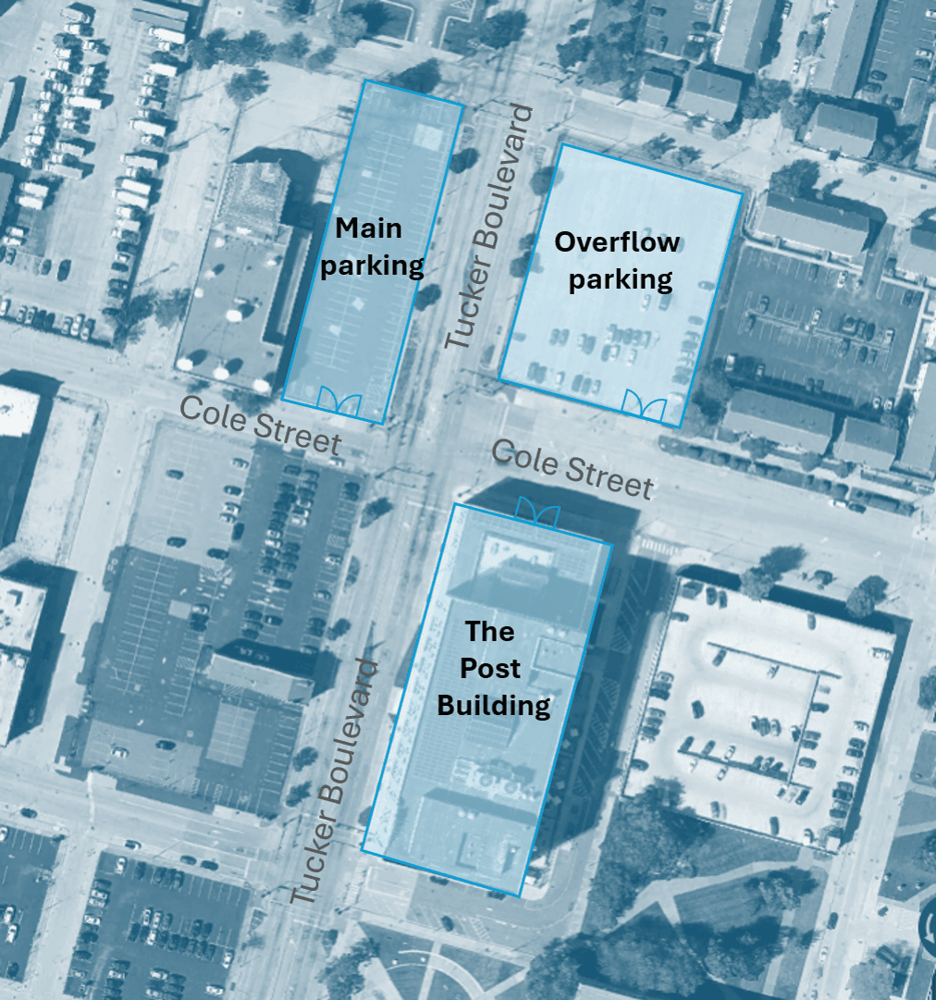

import LocationMap from '/src/components/location-map.tsx';
import { CollecticonCity } from '/src/components/icons/city';
import { CollecticonPlaneDeparture } from '/src/components/icons/plane-departure';
import { CollecticonTrain } from '/src/components/icons/train';

## What it is

**SatSummit** is an event that gathers leaders in the satellite industry and experts in global development for 2 days of presentations and in-depth conversations on solving the world's most critical development challenges with satellite data.

## When and Where:
November 18 & 19 at The Post Building, in St. Louis, MO.

<LocationMap
  coordinates={[-90.19515, 38.63486]}
  url='https://www.thepoststl.com/'
  location='The Post Building'
  center={[-90.19515, 38.63486]}
  zoom={15}
  minZoom={13.5}
  poiMarkers={[
    {
      name: 'Airport',
      coordinates: [-90.37487, 38.75047],
      icon: CollecticonPlaneDeparture
    },
    {
      name: 'Train Station',
      coordinates: [-90.20363, 38.62447],
      icon: CollecticonTrain
    }
  ]}
/>

## How to get to the venue
The Post Building is located at 1190 Cole St, St. Louis, MO 63101. Access the main entrance on Cole Street, which is on the north side of the building.

 
Upon arrival, guests will check-in at the lobby  security desk.Follow the registration sign, which is in the Main Press Hall. SatSummit team members will check you in the registration area.

### By cab or ride share
Ask to be dropped off at 1190 Cole St, St. Louis, MO 63101 at the north entrance of The Post Building.
 
### Parking
Complimentary parking is provided next of The Post Building at the north west corner Tucker Boulevard and Cole street.

## Accommodation
 
There are no room blocks or codes for SatSummit. Closest recommended hotels are:
- [Angad Arts Hotel](https://www.hilton.com/en/hotels/stlaaup-angad-arts-hotel-st-louis/), 3550 Samuel Sheppard Dr, St. Louis, MO 63103 **(~2.5 mi)**
- [21c Museum Hotel](https://21cmuseumhotels.com/st-louis/) St. Louis, 1528 Locust St, St. Louis, MO 63103 **(~1 mi)**
- [Courtyard St. Louis Downtown/Convention Center](https://www.marriott.com/en-us/hotels/stldw-courtyard-st-louis-downtown-convention-center/overview/), 823 Washington Ave, St. Louis, MO 63101 **(~0.5 mi)**

---

## Frequently Asked Questions

### Am I able to purchase tickets for only one day of the event?

No, registration includes access to both days of **SatSummit**. 

### Will there be a livestream or recordings?

This year there will not be a livestream or recordings of sessions available. If you weren't able to join this year, we hope you'll be able to join us at a future in-person event.

### Is the venue wheelchair accessible?

The venue is fully ADA compliant. Should you need any accommodations to make this event accessible to you, please reach out to us at [**info@satsummit.io**](mailto:info@satsummit.io).

### Is there a Mother's room available if I am nursing?

Yes, we have a private and comfortable space available for nursing mothers.

### Is there a Code of Conduct in place?

Yes, there is. In order to offer a positive and safe environment for all attendees, we ask that you review the **[Code of Conduct](/code-of-conduct)**.
